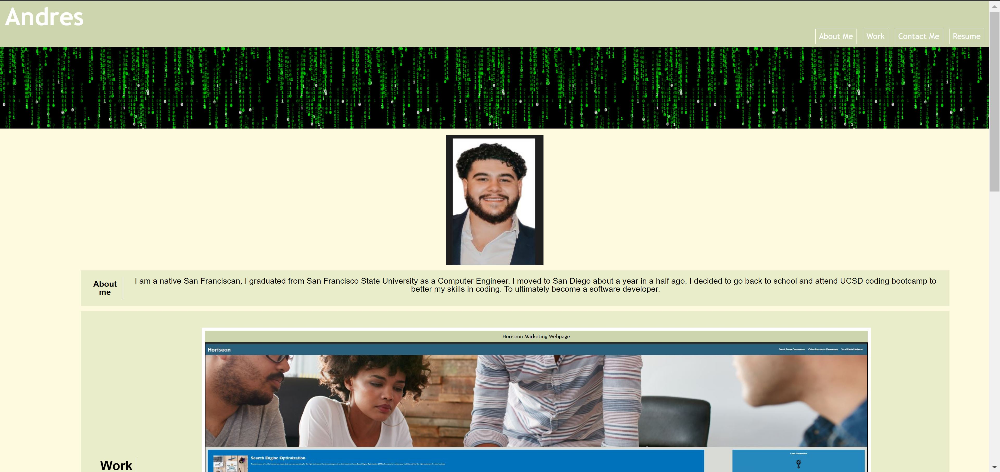
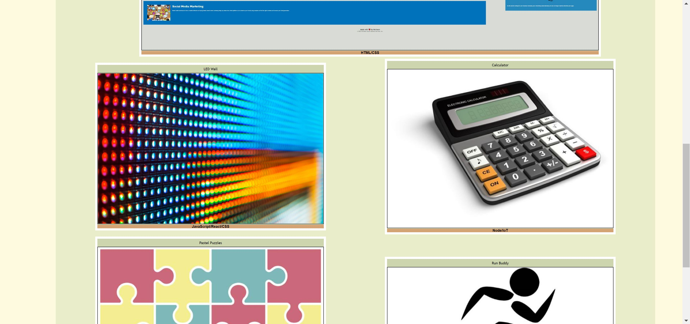
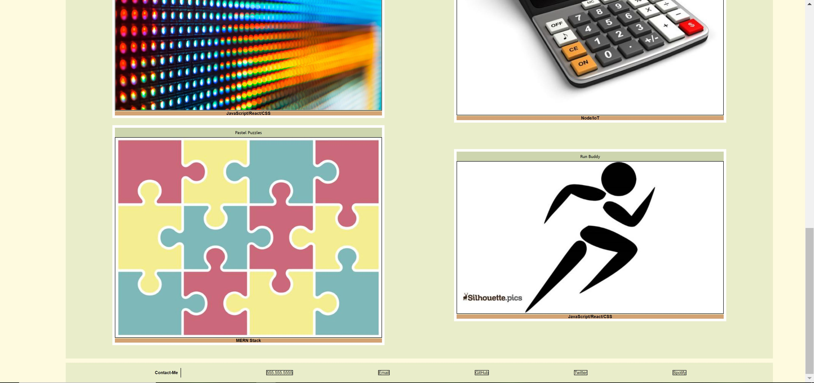

# Andres-Portfolio

## Description
This challange I made my own portfolio website where I can upload current and future projects. I learned how to implement flex to create my containers for all my projects. I had some trouble getting box one to be the biggest container out of all of them. I was able to accomplish this by learning more about flex and seeing what happens when I remove or add flex to certain attributes and elements. Using the Google Developer tool this made it easier to see the changes. 
## Usage
This image demostrates the web application appearance and fuctionality
.
.
.

## Credits
I used the activites in the UCSD folder to help me with this project as well as this youtube video https://www.youtube.com/watch?v=fYq5PXgSsbE to help me understand the way I need to setup my containers.

## License
N/A

## Features
Can take you to a specific location on the webpage by clicking on one of the nav links
also when you click on the project images it takes you to a specific link to see the website.

## Deployed Application
https://aserrano7.github.io/Andres-Portfolio/

